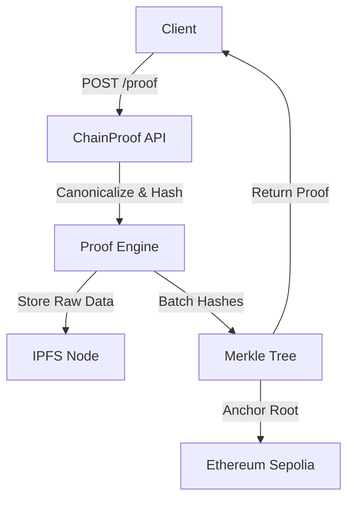

# 🚀 ChainProof

**ChainProof is a deterministic Web3 proof & audit service that anchors cryptographic commitments of off-chain data onto Ethereum while storing raw data on IPFS.**

Instead of storing raw data on-chain, ChainProof stores verifiable commitments — enabling scalable, tamper-proof, and cost-efficient audit infrastructure.

---

## 🧠 Problem Statement

In modern Web3 systems, most activity happens **off-chain** (APIs, bots, trading engines, oracles). However, on-chain trust requires strict verifiability.

How do we prove that:

- A piece of data existed at a specific time?
- A service produced a specific output?
- A dataset was not tampered with?
- An off-chain event truly happened?

...without trusting a centralized server?

---

## 💡 Solution Overview

ChainProof solves this by providing:

1. **Deterministic canonicalization** (sorting keys, byte consistency)
2. **SHA256 hashing**
3. **IPFS content-addressed storage** for raw data
4. **Merkle batching** for gas scalability
5. **Ethereum anchoring** (Sepolia by default) for immutability
6. **Inclusion proofs** for client-side verification

Instead of storing raw data on-chain, we store only a **cryptographic commitment (Merkle root)**.

---

## 🏗 Architecture



Workflow summary:

- Client sends JSON data.
- Server canonicalizes, hashes, and optionally encrypts data.
- Raw data is pinned to IPFS.
- Hashes are batched into a Merkle Tree.
- Merkle Root is anchored on Ethereum (Sepolia by default).
- Inclusion Proof is returned to the client.

### Why Merkle Batching?

Without batching: 1 proof = 1 transaction → poor scalability & high gas cost.

With batching: N proofs = 1 transaction → massive throughput improvement.

Users receive Inclusion Proofs to verify their specific data is part of the anchored root.

---

## 🔐 Determinism Guarantees

ChainProof ensures strict determinism to guarantee distributed systems correctness:

- JSON keys are sorted alphabetically.
- Canonical byte representation.
- SHA256 hashing.
- Identical input set → Identical Merkle root.

---

## ⚙️ Setup Instructions

Requirements

- Go 1.24+
- Node.js + npm (for the frontend)
- IPFS daemon (local or remote)
- Sepolia RPC Endpoint (Infura/Alchemy/etc.)
- Funded test wallet (Sepolia ETH)

1. Clone the repo

```bash
git clone <repo-url>
cd chainproof
```

2. Environment variables

Create a `.env` file in the repository root. Example:

```dotenv
PORT=9000
ETH_RPC_URL=https://sepolia.infura.io/v3/YOUR_KEY
PRIVATE_KEY=your_private_key_without_0x
CONTRACT_ADDRESS=0xYourDeployedContractAddress
IPFS_ENDPOINT=http://localhost:5001
ENCRYPTION_ENABLED=true         # set to "true" to enable encryption
ENCRYPTION_KEY=<64-hex-chars>   # only required if ENCRYPTION_ENABLED=true
```

Important: `ENCRYPTION_KEY` must be a 64-character hex string (32 bytes). Generate one with:

```bash
openssl rand -hex 32
```

Make sure the hex string is on a single line (no line breaks) in `.env`.

3. Start IPFS (if required)

```bash
ipfs daemon
```

4. Start the server

```bash
export PORT=9000
go run cmd/server/main.go
```

5. Start the frontend (optional)

```bash
cd web
npm install
npm run dev
```

Open http://localhost:3000 (default Next.js dev) to access the UI.

---

## 📡 API Reference

### ✅ Health Check

GET /health

Response:

```json
{ "status": "ok" }
```

### 🧾 Create Proof

POST /proof

Content-Type: application/json

Body example:

```json
{ "data": { "x": 1, "y": 2, "event": "trade_execution" } }
```

Response example:

```json
{
  "hash": "e3b0c442...",
  "cid": "QmHash...",
  "tx_hash": "0x123...",
  "merkle_root": "abc...",
  "merkle_proof": [ { "hash": "def...", "position": "left" } ],
  "timestamp": "2023-10-27T10:00:00Z",
  "encrypted": false
}
```

### 🔍 Verify On-Chain

GET /verify?hash=<hex-hash>

Response example:

```json
{ "hash": "e3b0c442...", "on_chain": true, "block_number": 450123 }
```

Use `curl`:

```bash
curl "http://localhost:9000/verify?hash=<your-hash>"
```

---

## 🔎 Security & Limitations

Security Model

- Tamper Detection: via SHA256.
- Data Integrity: via IPFS Content IDs (CID).
- Immutability: via Ethereum blockchain anchoring.

Limitations (v1)

- Synchronous: HTTP response waits for block anchoring (can be slow).
- Single Worker: a single batch worker is used today.
- Persistence: No local DB; relies on IPFS and the blockchain.
- No advanced access controls: this project is an infra prototype.

---

## 🔮 Roadmap

- Async Architecture: decouple submission from mining (job queues).
- Database Layer: Postgres/SQLite for fast local lookups.
- Distributed Batching: multi-instance consensus.
- Frontend Dashboard: visual explorer for proofs.
- Zero-Knowledge: privacy-preserving proofs.
- Mainnet deployment flow and migration guide.

---

## 🧪 Testing & Debugging Tips

- Enable verbose logs on the server to view anchor and verify flows.
- Check IPFS gateway (http://localhost:8080) and API (http://localhost:5001).
- Confirm `ENCRYPTION_KEY` is correct length if `ENCRYPTION_ENABLED=true`.
- If the frontend cannot reach the backend, check CORS and that the server address in `NEXT_PUBLIC_BACKEND_URL` (frontend env) points to `http://localhost:9000`.

---

## 🏁 Version

ChainProof v1.0 — Deterministic, batched, verifiable Web3 proof infrastructure.

---
